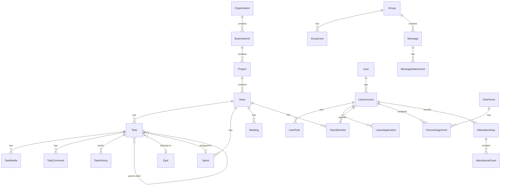

# System Diagrams

## Table of Contents
1. [Sequence Diagrams](#sequence-diagrams)
2. [Entity Relationship Diagrams](#entity-relationship-diagrams)
3. [Cron Workflow Diagrams](#cron-workflow-diagrams)
4. [Inter-Module Communication](#inter-module-communication)

---

## Sequence Diagrams

### 1. Authentication Flow

```
┌─────────┐     ┌───────────────┐     ┌─────────────┐     ┌───────┐     ┌───────┐
│ Client  │     │ AuthController│     │ AuthService │     │ Redis │     │  DB   │
└────┬────┘     └───────┬───────┘     └──────┬──────┘     └───┬───┘     └───┬───┘
     │                  │                    │                │             │
     │ POST /api/auth/login                  │                │             │
     │ {email, password}│                    │                │             │
     │─────────────────>│                    │                │             │
     │                  │                    │                │             │
     │                  │ validateCredentials│                │             │
     │                  │───────────────────>│                │             │
     │                  │                    │                │             │
     │                  │                    │ findByEmail    │             │
     │                  │                    │────────────────────────────>│
     │                  │                    │                │             │
     │                  │                    │<────────────────────────────│
     │                  │                    │   User Entity  │             │
     │                  │                    │                │             │
     │                  │                    │ verifyPassword │             │
     │                  │                    │ (PBKDF2Encoder)│             │
     │                  │                    │                │             │
     │                  │                    │ generateJWT    │             │
     │                  │                    │ (RS512 + RSA)  │             │
     │                  │                    │                │             │
     │                  │                    │ storeToken     │             │
     │                  │                    │───────────────>│             │
     │                  │                    │                │             │
     │                  │<───────────────────│                │             │
     │                  │   JWT Token        │                │             │
     │                  │                    │                │             │
     │<─────────────────│                    │                │             │
     │ {token, accountIds}                   │                │             │
     │                  │                    │                │             │
```

### 2. Task Creation Flow

```
┌─────────┐  ┌──────────────┐  ┌─────────────┐  ┌──────────────┐  ┌─────────────┐  ┌────────┐
│ Client  │  │TaskController│  │ TaskService │  │ TeamService  │  │NotifyService│  │   DB   │
└────┬────┘  └──────┬───────┘  └──────┬──────┘  └──────┬───────┘  └──────┬──────┘  └───┬────┘
     │              │                 │                │                 │             │
     │ POST /api/task/createTask      │                │                 │             │
     │ {title, teamId, ...}           │                │                 │             │
     │─────────────>│                 │                │                 │             │
     │              │                 │                │                 │             │
     │              │ createTask()    │                │                 │             │
     │              │────────────────>│                │                 │             │
     │              │                 │                │                 │             │
     │              │                 │ validateTeam() │                 │             │
     │              │                 │───────────────>│                 │             │
     │              │                 │                │                 │             │
     │              │                 │<───────────────│                 │             │
     │              │                 │  Team Entity   │                 │             │
     │              │                 │                │                 │             │
     │              │                 │ generateTaskNumber()             │             │
     │              │                 │ {TEAM_CODE}-{ID}                 │             │
     │              │                 │                │                 │             │
     │              │                 │ validateWorkflow()               │             │
     │              │                 │                │                 │             │
     │              │                 │ save(Task)     │                 │             │
     │              │                 │────────────────────────────────────────────────>│
     │              │                 │                │                 │             │
     │              │                 │<────────────────────────────────────────────────│
     │              │                 │                │                 │             │
     │              │                 │ sendNotification()               │             │
     │              │                 │─────────────────────────────────>│             │
     │              │                 │                │                 │             │
     │              │                 │                │                 │ FCM Push    │
     │              │                 │                │                 │────────────>│
     │              │                 │                │                 │             │
     │              │<────────────────│                │                 │             │
     │              │ TaskResponse    │                │                 │             │
     │              │                 │                │                 │             │
     │<─────────────│                 │                │                 │             │
     │ {taskId, taskNumber}           │                │                 │             │
```

### 3. Leave Application Flow

```
┌─────────┐  ┌───────────────┐  ┌─────────────┐  ┌─────────────┐  ┌──────────────┐  ┌────────┐
│ Client  │  │LeaveController│  │LeaveService │  │PolicyService│  │NotifyService │  │   DB   │
└────┬────┘  └───────┬───────┘  └──────┬──────┘  └──────┬──────┘  └──────┬───────┘  └───┬────┘
     │               │                 │                │                │              │
     │ POST /api/leave/apply           │                │                │              │
     │ {fromDate, toDate, type}        │                │                │              │
     │──────────────>│                 │                │                │              │
     │               │                 │                │                │              │
     │               │ applyLeave()    │                │                │              │
     │               │────────────────>│                │                │              │
     │               │                 │                │                │              │
     │               │                 │ getLeavePolicy()                │              │
     │               │                 │───────────────>│                │              │
     │               │                 │                │                │              │
     │               │                 │<───────────────│                │              │
     │               │                 │  LeavePolicy   │                │              │
     │               │                 │                │                │              │
     │               │                 │ checkBalance() │                │              │
     │               │                 │ (initialLeaves - taken)         │              │
     │               │                 │                │                │              │
     │               │                 │ validateDates()│                │              │
     │               │                 │ (no overlap, weekends)          │              │
     │               │                 │                │                │              │
     │               │                 │ calculateLeaveDays()            │              │
     │               │                 │ (exclude holidays)              │              │
     │               │                 │                │                │              │
     │               │                 │ save(LeaveApplication)          │              │
     │               │                 │───────────────────────────────────────────────>│
     │               │                 │                │                │              │
     │               │                 │ notifyManager()│                │              │
     │               │                 │────────────────────────────────>│              │
     │               │                 │                │                │              │
     │               │<────────────────│                │                │              │
     │               │ status=WAITING_APPROVAL         │                │              │
     │               │                 │                │                │              │
     │<──────────────│                 │                │                │              │
     │ {applicationId, status}         │                │                │              │
```

### 4. Meeting Creation with Jitsi Integration

```
┌─────────┐  ┌─────────────────┐  ┌───────────────┐  ┌──────────────┐  ┌────────┐
│ Client  │  │MeetingController│  │MeetingService │  │ SHAJWTUtil   │  │   DB   │
└────┬────┘  └────────┬────────┘  └───────┬───────┘  └──────┬───────┘  └───┬────┘
     │                │                   │                 │              │
     │ POST /api/meeting/create           │                 │              │
     │ {agenda, attendees, dateTime}      │                 │              │
     │───────────────>│                   │                 │              │
     │                │                   │                 │              │
     │                │ createMeeting()   │                 │              │
     │                │──────────────────>│                 │              │
     │                │                   │                 │              │
     │                │                   │ generateMeetingKey()           │
     │                │                   │ (UUID for Jitsi room)          │
     │                │                   │                 │              │
     │                │                   │ generateMeetingNumber()        │
     │                │                   │ {TEAM}-MTG-{ID} │              │
     │                │                   │                 │              │
     │                │                   │ generateJitsiToken()           │
     │                │                   │────────────────>│              │
     │                │                   │                 │              │
     │                │                   │<────────────────│              │
     │                │                   │ HS256 JWT       │              │
     │                │                   │                 │              │
     │                │                   │ save(Meeting)   │              │
     │                │                   │─────────────────────────────────>│
     │                │                   │                 │              │
     │                │                   │ createAttendees()              │
     │                │                   │─────────────────────────────────>│
     │                │                   │                 │              │
     │                │                   │ sendInvitations()              │
     │                │                   │ (FCM + Email)   │              │
     │                │                   │                 │              │
     │                │<──────────────────│                 │              │
     │                │                   │                 │              │
     │<───────────────│                   │                 │              │
     │ {meetingId, meetingKey, jitsiUrl}  │                 │              │
```

### 5. Chat Message Flow (WebSocket)

```
┌─────────┐   ┌───────────────┐   ┌──────────────┐   ┌─────────────────┐   ┌────────┐
│ Client  │   │WebSocketHandler│   │MessageService│   │DeliveryScheduler│   │   DB   │
└────┬────┘   └───────┬────────┘   └──────┬───────┘   └────────┬────────┘   └───┬────┘
     │                │                   │                    │                │
     │ CONNECT /ws    │                   │                    │                │
     │ (JWT in header)│                   │                    │                │
     │───────────────>│                   │                    │                │
     │                │                   │                    │                │
     │                │ validateToken()   │                    │                │
     │                │ (call TSe_Server) │                    │                │
     │                │                   │                    │                │
     │<───────────────│                   │                    │                │
     │ CONNECTED      │                   │                    │                │
     │                │                   │                    │                │
     │ SEND /message  │                   │                    │                │
     │ {content, groupId}                 │                    │                │
     │───────────────>│                   │                    │                │
     │                │                   │                    │                │
     │                │ saveMessage()     │                    │                │
     │                │──────────────────>│                    │                │
     │                │                   │                    │                │
     │                │                   │ save(Message)      │                │
     │                │                   │─────────────────────────────────────>│
     │                │                   │                    │                │
     │                │                   │ broadcastToGroup() │                │
     │                │                   │ (via WebSocket)    │                │
     │                │                   │                    │                │
     │<───────────────│                   │                    │                │
     │ MESSAGE {id, content, sender}      │                    │                │
     │                │                   │                    │                │
     │                │                   │                    │                │
     │ ACK {messageId}│                   │                    │                │
     │───────────────>│                   │                    │                │
     │                │                   │                    │                │
     │                │                   │ bufferAck()        │                │
     │                │                   │───────────────────>│                │
     │                │                   │                    │                │
     │                │                   │                    │ [Every 2s]     │
     │                │                   │                    │ processBatch() │
     │                │                   │                    │───────────────>│
     │                │                   │                    │                │
```

---

## Entity Relationship Diagrams

### Core Entities ER Diagram

```
┌─────────────────────────────────────────────────────────────────────────────────────────┐
│                              ORGANIZATION HIERARCHY                                      │
└─────────────────────────────────────────────────────────────────────────────────────────┘

┌──────────────────┐       ┌──────────────────┐       ┌──────────────────┐
│   Organization   │       │   BusinessUnit   │       │     Project      │
├──────────────────┤       ├──────────────────┤       ├──────────────────┤
│ PK orgId         │       │ PK buId          │       │ PK projectId     │
│    orgName       │──────<│ FK orgId         │──────<│ FK buId          │
│    ownerAccountId│  1:N  │    buName        │  1:N  │    projectName   │
│    isActive      │       │    description   │       │    description   │
└──────────────────┘       └──────────────────┘       └────────┬─────────┘
                                                               │
                                                               │ 1:N
                                                               ▼
                                                     ┌──────────────────┐
                                                     │      Team        │
                                                     ├──────────────────┤
                                                     │ PK teamId        │
                                                     │ FK projectId     │
                                                     │    teamName      │
                                                     │    teamCode      │
                                                     │    isDeleted     │
                                                     └────────┬─────────┘
                                                              │
                              ┌────────────────┬──────────────┼──────────────┐
                              │ 1:N            │ 1:N          │ 1:N          │ 1:N
                              ▼                ▼              ▼              ▼
                    ┌─────────────────┐  ┌──────────┐  ┌───────────┐  ┌───────────┐
                    │   TeamMember    │  │   Task   │  │   Sprint  │  │  Meeting  │
                    ├─────────────────┤  ├──────────┤  ├───────────┤  ├───────────┤
                    │ FK teamId       │  │ PK taskId│  │PK sprintId│  │PK meetingId│
                    │ FK accountId    │  │ FK teamId│  │ FK teamId │  │ FK teamId │
                    │    roleId       │  │taskNumber│  │sprintTitle│  │   agenda  │
                    └─────────────────┘  └──────────┘  └───────────┘  └───────────┘


┌─────────────────────────────────────────────────────────────────────────────────────────┐
│                                    USER HIERARCHY                                        │
└─────────────────────────────────────────────────────────────────────────────────────────┘

┌──────────────────┐         ┌──────────────────┐         ┌──────────────────┐
│      User        │         │   UserAccount    │         │    UserRole      │
├──────────────────┤         ├──────────────────┤         ├──────────────────┤
│ PK userId        │         │ PK accountId     │         │ PK userRoleId    │
│    primaryEmail  │────────<│ FK userId        │────────<│ FK accountId     │
│    firstName     │   1:N   │ FK orgId         │   1:N   │ FK roleId        │
│    lastName      │         │    email         │         │ FK entityTypeId  │
│    isActive      │         │    isDefault     │         │ FK entityId      │
│    multiAssociation        │    isActive      │         └──────────────────┘
└──────────────────┘         └────────┬─────────┘
                                      │
                                      │ 1:N
                                      ▼
                            ┌──────────────────┐
                            │ LeaveApplication │
                            ├──────────────────┤
                            │ PK leaveAppId    │
                            │ FK accountId     │
                            │    fromDate      │
                            │    toDate        │
                            │    status        │
                            │    leaveTypeId   │
                            └──────────────────┘


┌─────────────────────────────────────────────────────────────────────────────────────────┐
│                                    TASK HIERARCHY                                        │
└─────────────────────────────────────────────────────────────────────────────────────────┘

┌────────────────────┐
│       Task         │
├────────────────────┤
│ PK taskId          │
│ FK teamId          │◄──────────────────────────────────────────────┐
│ FK parentTaskId    │────────────────┐ (Self-referencing)           │
│ FK fkEpicId        │                │                              │
│ FK assigneeAccountId               │                              │
│ FK sprintId        │                │                              │
│    taskNumber      │                │                              │
│    taskTitle       │                │                              │
│    taskTypeId      │ ◄──────────────┘                              │
│    taskState       │                                               │
│    taskWorkflowId  │                                               │
│    taskEstimate    │                                               │
│    currentActivityIndicator                                        │
│    childTaskIds[]  │───────────────────────────────────────────────┘
└─────────┬──────────┘
          │
          │ 1:N
          ├─────────────────┬─────────────────┬─────────────────┐
          ▼                 ▼                 ▼                 ▼
┌─────────────────┐ ┌─────────────────┐ ┌─────────────────┐ ┌─────────────────┐
│   TaskMedia     │ │   TaskComment   │ │  TaskHistory    │ │ TaskDependency  │
├─────────────────┤ ├─────────────────┤ ├─────────────────┤ ├─────────────────┤
│ PK taskMediaId  │ │ PK commentId    │ │ PK historyId    │ │ FK sourceTaskId │
│ FK taskId       │ │ FK taskId       │ │ FK taskId       │ │ FK targetTaskId │
│    fileName     │ │    content      │ │    columnName   │ │    dependencyType│
│    fileData     │ │    createdBy    │ │    oldValue     │ └─────────────────┘
└─────────────────┘ └─────────────────┘ │    newValue     │
                                        └─────────────────┘


┌─────────────────────────────────────────────────────────────────────────────────────────┐
│                                 CHAT ENTITIES (chat schema)                              │
└─────────────────────────────────────────────────────────────────────────────────────────┘

┌──────────────────┐         ┌──────────────────┐         ┌──────────────────┐
│      Group       │         │    GroupUser     │         │     Message      │
├──────────────────┤         ├──────────────────┤         ├──────────────────┤
│ PK groupId       │         │ PK groupUserId   │         │ PK messageId     │
│    groupName     │────────<│ FK groupId       │         │ FK groupId       │
│    groupType     │   1:N   │ FK userId        │         │ FK senderId      │
│    createdBy     │         │    isAdmin       │         │    content       │
│    orgId         │         │    joinedAt      │         │    messageType   │
└──────────────────┘         └──────────────────┘         │    isDeleted     │
                                                          │    createdAt     │
                                                          └────────┬─────────┘
                                                                   │ 1:N
                                                                   ▼
                                                          ┌──────────────────┐
                                                          │MessageAttachment │
                                                          ├──────────────────┤
                                                          │ PK attachmentId  │
                                                          │ FK messageId     │
                                                          │    fileName      │
                                                          │    fileType      │
                                                          │    fileData      │
                                                          └──────────────────┘


┌─────────────────────────────────────────────────────────────────────────────────────────┐
│                                 ATTENDANCE/GEO-FENCING                                   │
└─────────────────────────────────────────────────────────────────────────────────────────┘

┌──────────────────┐         ┌──────────────────┐         ┌──────────────────┐
│    GeoFence      │         │ FenceAssignment  │         │  AttendanceDay   │
├──────────────────┤         ├──────────────────┤         ├──────────────────┤
│ PK fenceId       │         │ PK assignmentId  │         │ PK attendanceId  │
│ FK orgId         │────────<│ FK fenceId       │         │ FK accountId     │
│    centerLat     │   1:N   │ FK accountId     │         │    dateKey       │
│    centerLng     │         │    effectiveFrom │         │    firstInUtc    │
│    radiusM       │         │    effectiveTo   │         │    lastOutUtc    │
│    fenceName     │         └──────────────────┘         │    workedSeconds │
│    locationKind  │                                      │    status        │
└──────────────────┘                                      └────────┬─────────┘
                                                                   │ 1:N
                                                                   ▼
                                                          ┌──────────────────┐
                                                          │ AttendanceEvent  │
                                                          ├──────────────────┤
                                                          │ PK eventId       │
                                                          │ FK attendanceId  │
                                                          │    eventType     │
                                                          │    timestamp     │
                                                          │    latitude      │
                                                          │    longitude     │
                                                          └──────────────────┘
```

### Mermaid ER Diagram (for rendering)



---

## Cron Workflow Diagrams

### Notification_Reminders Module - Scheduled Tasks

```
┌─────────────────────────────────────────────────────────────────────────────────────────┐
│                           SCHEDULED TASKS WORKFLOW                                       │
│                         (Notification_Reminders Module)                                  │
└─────────────────────────────────────────────────────────────────────────────────────────┘

                              ┌────────────────────────┐
                              │   SchedulerService     │
                              │   (Spring @Scheduled)  │
                              └───────────┬────────────┘
                                          │
          ┌───────────────────────────────┼───────────────────────────────┐
          │                               │                               │
          ▼                               ▼                               ▼
┌──────────────────┐          ┌──────────────────┐          ┌──────────────────┐
│  MEETING TASKS   │          │   LEAVE TASKS    │          │  TIMESHEET TASKS │
├──────────────────┤          ├──────────────────┤          ├──────────────────┤
│                  │          │                  │          │                  │
│ @Scheduled       │          │ @Scheduled       │          │ @Scheduled       │
│ cron="0 * * * *" │          │ cron="0 0 0 1 1 *"          │ cron="0 0 8 * * *"│
│                  │          │ (Jan 1, midnight)│          │ (8 AM daily)     │
│ ┌──────────────┐ │          │ ┌──────────────┐ │          │ ┌──────────────┐ │
│ │Meeting       │ │          │ │Leave Balance │ │          │ │Pre-Reminder  │ │
│ │Reminder      │ │          │ │Reset         │ │          │ │(Fill sheet)  │ │
│ └──────────────┘ │          │ └──────────────┘ │          │ └──────────────┘ │
│                  │          │                  │          │                  │
│ ┌──────────────┐ │          │ ┌──────────────┐ │          │ ┌──────────────┐ │
│ │Start Meeting │ │          │ │Monthly Leave │ │          │ │Post-Reminder │ │
│ │Confirmation  │ │          │ │Update        │ │          │ │(Submit sheet)│ │
│ └──────────────┘ │          │ │(Pro-rata)    │ │          │ └──────────────┘ │
│                  │          │ └──────────────┘ │          │                  │
└────────┬─────────┘          └────────┬─────────┘          └────────┬─────────┘
         │                             │                             │
         │                             │                             │
         └─────────────────────────────┼─────────────────────────────┘
                                       │
                                       ▼
                              ┌────────────────────────┐
                              │     TSe_Server         │
                              │   /api/schedule/*      │
                              │   (REST API calls)     │
                              └────────────────────────┘


┌─────────────────────────────────────────────────────────────────────────────────────────┐
│                              CRON SCHEDULE OVERVIEW                                      │
└─────────────────────────────────────────────────────────────────────────────────────────┘

┌──────────────────────────────────────────────────────────────────────────────────────────┐
│ TASK                          │ CRON EXPRESSION      │ DESCRIPTION                       │
├──────────────────────────────────────────────────────────────────────────────────────────┤
│ Meeting Reminder              │ 0 * * * * *          │ Every minute                      │
│ Meeting Start Confirmation    │ 0 * * * * *          │ Every minute                      │
│ Leave Balance Reset           │ 0 0 0 1 1 *          │ Jan 1st, midnight                 │
│ Leave Monthly Update          │ 0 0 0 1 * *          │ 1st of month, midnight            │
│ Timesheet Pre-Reminder        │ 0 0 8 * * MON-FRI    │ 8 AM weekdays                     │
│ Timesheet Post-Reminder       │ 0 0 18 * * MON-FRI   │ 6 PM weekdays                     │
│ Dependency Alert              │ 0 0 9 * * *          │ 9 AM daily                        │
│ Delete Old Alerts             │ 0 0 0 * * *          │ Midnight daily                    │
│ Sprint Task Mail              │ 0 0 9 * * MON        │ 9 AM Mondays                      │
│ Geo-fence Shift Start         │ 0 */15 * * * *       │ Every 15 minutes                  │
│ Auto-Checkout                 │ 0 * * * * *          │ Every minute                      │
│ Notification Cleanup          │ 0 0 0 * * *          │ Midnight daily                    │
│ AI Retry Registration         │ 0 0 */6 * * *        │ Every 6 hours                     │
│ Sprint Burndown Update        │ 0 0 1 * * *          │ 1 AM daily                        │
│ Effort Reminder               │ 0 0 17 * * MON-FRI   │ 5 PM weekdays                     │
│ Leave Expiry Check            │ 0 0 9 * * *          │ 9 AM daily                        │
│ Meeting Feedback Reminder     │ 0 0 10 * * *         │ 10 AM daily                       │
│ Task Due Reminder             │ 0 0 9 * * *          │ 9 AM daily                        │
│ Weekly Summary                │ 0 0 9 * * MON        │ 9 AM Mondays                      │
│ Daily Digest                  │ 0 0 8 * * MON-FRI    │ 8 AM weekdays                     │
│ FCM Token Cleanup             │ 0 0 2 * * SUN        │ 2 AM Sundays                      │
│ Orphan File Cleanup           │ 0 0 3 * * SUN        │ 3 AM Sundays                      │
└──────────────────────────────────────────────────────────────────────────────────────────┘


┌─────────────────────────────────────────────────────────────────────────────────────────┐
│                              MEETING REMINDER FLOW                                       │
└─────────────────────────────────────────────────────────────────────────────────────────┘

    Every Minute
         │
         ▼
┌─────────────────┐
│ ScheduledTasks  │
│ .meetingReminder│
└────────┬────────┘
         │
         ▼
┌─────────────────────────────────────────────────────────────────────┐
│                    HTTP GET to TSe_Server                           │
│           http://localhost:8080/api/schedule/meeting/reminder       │
└────────────────────────────────┬────────────────────────────────────┘
                                 │
                                 ▼
                    ┌────────────────────────┐
                    │   ScheduleController   │
                    │   .meetingReminder()   │
                    └───────────┬────────────┘
                                │
                                ▼
                    ┌────────────────────────┐
                    │    MeetingService      │
                    │ .sendMeetingReminders()│
                    └───────────┬────────────┘
                                │
                                ▼
              ┌─────────────────────────────────────┐
              │ Query meetings starting in:         │
              │ - 30 minutes                        │
              │ - 15 minutes                        │
              │ - 5 minutes                         │
              └─────────────────┬───────────────────┘
                                │
                    ┌───────────┴───────────┐
                    │                       │
                    ▼                       ▼
          ┌─────────────────┐     ┌─────────────────┐
          │ FCM Push        │     │ In-App          │
          │ Notification    │     │ Notification    │
          └─────────────────┘     └─────────────────┘


┌─────────────────────────────────────────────────────────────────────────────────────────┐
│                            AUTO-CHECKOUT FLOW                                            │
└─────────────────────────────────────────────────────────────────────────────────────────┘

    Every Minute
         │
         ▼
┌─────────────────┐
│ ScheduledTasks  │
│ .autoCheckout   │
└────────┬────────┘
         │
         ▼
┌─────────────────────────────────────────────────────────────────────┐
│           HTTP GET to TSe_Server                                    │
│    http://localhost:8080/api/schedule/geo-fencing/autoCheckout      │
└────────────────────────────────┬────────────────────────────────────┘
                                 │
                                 ▼
                    ┌────────────────────────┐
                    │   ScheduleController   │
                    │   .autoCheckout()      │
                    └───────────┬────────────┘
                                │
                                ▼
                    ┌────────────────────────┐
                    │ AttendanceService      │
                    │ .processAutoCheckout() │
                    └───────────┬────────────┘
                                │
                                ▼
              ┌─────────────────────────────────────┐
              │ Find users who:                     │
              │ - Have active punch-in              │
              │ - Shift has ended                   │
              │ - No punch-out recorded             │
              └─────────────────┬───────────────────┘
                                │
                                ▼
              ┌─────────────────────────────────────┐
              │ For each user:                      │
              │ 1. Create PUNCH_OUT event           │
              │ 2. Set anomalies: {auto_checkout}   │
              │ 3. Calculate workedSeconds          │
              │ 4. Update AttendanceDay             │
              └─────────────────────────────────────┘
```

---

## Inter-Module Communication

### Module Communication Flow

```
┌─────────────────────────────────────────────────────────────────────────────────────────┐
│                           INTER-MODULE COMMUNICATION                                     │
└─────────────────────────────────────────────────────────────────────────────────────────┘


                    ┌──────────────────────────────────┐
                    │         FRONTEND CLIENT          │
                    │      (Angular/React/Mobile)      │
                    └───────────────┬──────────────────┘
                                    │
                                    │ HTTP/HTTPS
                    ┌───────────────┼───────────────┐
                    │               │               │
                    ▼               ▼               ▼
        ┌───────────────────┐ ┌──────────┐ ┌───────────────────┐
        │   TSe_Server      │ │  TSEHR   │ │     Chat-App      │
        │   Port: 8080      │ │Port: 8081│ │   Port: 8082      │
        │   /api/*          │ │          │ │                   │
        └─────────┬─────────┘ └────┬─────┘ └─────────┬─────────┘
                  │                │                 │
                  │                │                 │
    ┌─────────────┼────────────────┼─────────────────┼─────────────┐
    │             │                │                 │             │
    │             ▼                ▼                 ▼             │
    │  ┌─────────────────────────────────────────────────────┐    │
    │  │              SHARED PostgreSQL DATABASE              │    │
    │  │                                                      │    │
    │  │  ┌─────────────┐              ┌─────────────┐       │    │
    │  │  │  tse schema │              │ chat schema │       │    │
    │  │  │             │              │             │       │    │
    │  │  │ - User      │              │ - Group     │       │    │
    │  │  │ - Task      │              │ - Message   │       │    │
    │  │  │ - Meeting   │              │ - GroupUser │       │    │
    │  │  │ - Leave     │              │             │       │    │
    │  │  │ - Sprint    │              │             │       │    │
    │  │  │ - GeoFence  │              │             │       │    │
    │  │  └─────────────┘              └─────────────┘       │    │
    │  │                                                      │    │
    │  └─────────────────────────────────────────────────────┘    │
    │                                                              │
    └──────────────────────────────────────────────────────────────┘


┌─────────────────────────────────────────────────────────────────────────────────────────┐
│                              REST API CALLS BETWEEN MODULES                              │
└─────────────────────────────────────────────────────────────────────────────────────────┘

┌─────────────────────────────────────────────────────────────────────────────────────────┐
│                                                                                         │
│   ┌───────────────────────┐                      ┌───────────────────────┐             │
│   │ Notification_Reminders│                      │      TSe_Server       │             │
│   │     (Scheduler)       │                      │      Port: 8080       │             │
│   │     Port: 8081        │─────────────────────>│                       │             │
│   │                       │  HTTP GET            │  /api/schedule/*      │             │
│   │  @Scheduled tasks     │  - /meeting/reminder │  - MeetingController  │             │
│   │  call TSe_Server      │  - /leave/reset      │  - LeaveController    │             │
│   │                       │  - /geo-fencing/*    │  - GeoFenceController │             │
│   └───────────────────────┘                      └───────────────────────┘             │
│                                                                                         │
│   ┌───────────────────────┐                      ┌───────────────────────┐             │
│   │      Chat-App         │                      │      TSe_Server       │             │
│   │     Port: 8082        │─────────────────────>│      Port: 8080       │             │
│   │                       │  HTTP POST           │                       │             │
│   │  Token validation     │  /api/auth/validate  │  /api/auth/*          │             │
│   │  User lookup          │  TokenAccount        │  - AuthController     │             │
│   │                       │                      │                       │             │
│   └───────────────────────┘                      └───────────────────────┘             │
│                                                                                         │
│   ┌───────────────────────┐                      ┌───────────────────────┐             │
│   │      TSe_Server       │                      │        TSEHR          │             │
│   │     Port: 8080        │─────────────────────>│      Port: 8081       │             │
│   │                       │  HTTP GET/POST       │                       │             │
│   │  Timesheet data       │  /leave/*            │  /leave/*             │             │
│   │  Leave info           │  /timesheet/*        │  /timesheet/*         │             │
│   │                       │                      │                       │             │
│   └───────────────────────┘                      └───────────────────────┘             │
│                                                                                         │
└─────────────────────────────────────────────────────────────────────────────────────────┘


┌─────────────────────────────────────────────────────────────────────────────────────────┐
│                              EXTERNAL SERVICE INTEGRATIONS                               │
└─────────────────────────────────────────────────────────────────────────────────────────┘

                    ┌───────────────────────┐
                    │      TSe_Server       │
                    │      Port: 8080       │
                    └───────────┬───────────┘
                                │
        ┌───────────────────────┼───────────────────────┐
        │                       │                       │
        ▼                       ▼                       ▼
┌───────────────┐      ┌───────────────┐      ┌───────────────┐
│    Firebase   │      │    GitHub     │      │     Jitsi     │
│     (FCM)     │      │    OAuth      │      │   (Meetings)  │
├───────────────┤      ├───────────────┤      ├───────────────┤
│ Push          │      │ OAuth2 flow   │      │ JWT tokens    │
│ notifications │      │ Branch sync   │      │ Video rooms   │
│               │      │ PR/Issue link │      │               │
└───────────────┘      └───────────────┘      └───────────────┘

        ┌───────────────────────┐
        │      Google OAuth     │
        │   (Authentication)    │
        ├───────────────────────┤
        │ SSO login             │
        │ Calendar integration  │
        └───────────────────────┘

        ┌───────────────────────┐
        │      Redis Cache      │
        ├───────────────────────┤
        │ OTP storage           │
        │ Session tokens        │
        │ Rate limiting         │
        └───────────────────────┘

        ┌───────────────────────┐
        │   File Scan Service   │
        │  (Malware Detection)  │
        ├───────────────────────┤
        │ URL: scanfile.endpoint│
        │ Virus scanning        │
        └───────────────────────┘
```

---

## Summary

This document provides visual representations of:
1. **Sequence Diagrams** - Authentication, Task, Leave, Meeting, Chat flows
2. **ER Diagrams** - Organization hierarchy, User system, Task hierarchy, Chat entities
3. **Cron Workflows** - 22 scheduled tasks with timing and dependencies
4. **Inter-Module Communication** - REST API calls, shared database, external integrations
